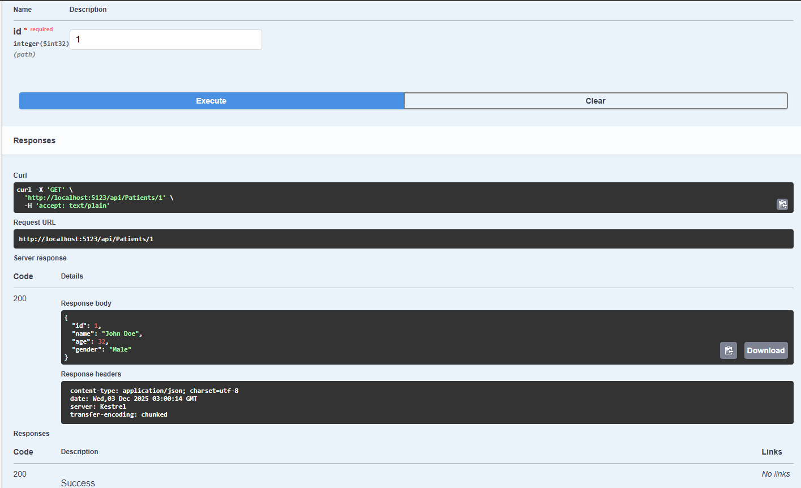

# PatientAPI (C# ASP.NET Web API)

A simple practice API built to learn controllers, services, dependency injection, and Swagger in .NET 8.

## Endpoints:
GET /api/patients  
GET /api/patients/{id}  
POST /api/patients